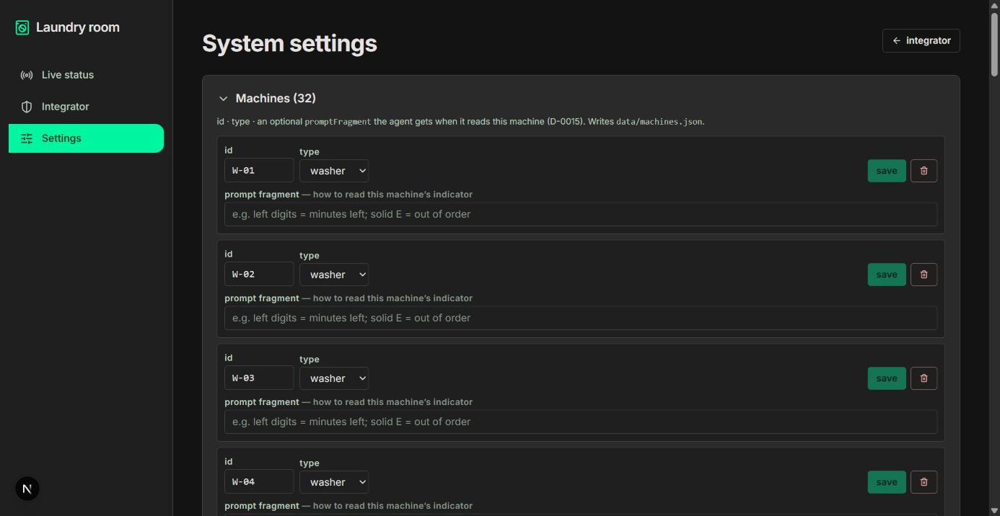

# laundry3

A project for the **micro1 Agentic Workflows Hackathon**. Deadline for a working solution:
2026-08-30 12:00 UTC-7.

## The intended user & the bottleneck

A tenant in an apartment complex with a **shared laundry room** (here: 16 washers + 16
dryers). Today, to do laundry they gather a full bag, carry it down to the laundry room,
and often find **every machine occupied** — then carry the bag back, wait an unknown
amount of time, and try again, hauling the laundry on every attempt. There is no way to
check availability before the trip, and no way to hold a machine for the few minutes it
takes to walk over.

**laundry3** reads frames from the laundry-room cameras with an agent and publishes a
per-machine **free / occupied / out-of-order / unknown** list, so the tenant checks first
and only walks over when a machine is actually available. Why it matters: it removes wasted
trips and the physical effort of carrying laundry back and forth; for the building it means
better-used machines and fewer complaints.

Full problem statement, scope, phasing, and the data/privacy plan: **`docs/PROBLEM.md`**.

## What's built (hackathon scope)

The core P0: given a laundry-room frame, produce a **verified per-machine status list**.

- **Baseline** — one whole-frame vision call, told which machine ids the camera covers.
- **Calibrated agent** — the same call plus the camera's annotated shot + mask as extra
  vision inputs (D-0015). **Dead-end** — see below.
- **ROI agent** — crop the frame to each machine's own colour region in an integrator-painted
  region map, one call per machine (`src/agent/roi.ts`). The architecturally-right approach;
  not a measured win at this sample size — see below.
- **Integrator corrections (D-0014)** — an integrator records a machine's true state once;
  a `machine`-scope correction overrides the agent for that unit in every frame and every
  future capture.

### Results — `claude-haiku-4-5`, 5 committed frames (one per calibrated camera), 22 determinate observations, single sample

| Metric | Baseline | Calibrated (images) | ROI (region crops) | **Baseline + corr.** | ROI + corr. |
| --- | --- | --- | --- | --- | --- |
| Per-machine accuracy | 45.5% | 31.8% | 40.9% | **68.2%** | 63.6% |
| **Harmful-error rate** (told `free`, actually not) | 9.1% | 0.0% | 9.1% | 4.5% | **4.5%** |
| Coverage (gave an actionable answer) | 100% | 100% | 86% | 100% | 91% |
| **`out_of_order` recall** | 0/5 | 0/5 | 0/5 | **5/5** | 5/5 |
| Model cost per frame | ~$0.003 | ~$0.007 | ~$0.004 | ~$0.003 | ~$0.004 |

**Two calibration attempts, one dead-end and one architecturally-right-but-not-a-win:**

- **Calibrated (feeding the annotated shot + mask as extra vision inputs) is a dead-end**
  (−13.7 pp): the model reads state off the flat-colour annotation, and the mostly-black
  mask image collapses it onto "occupied" for every machine (`free` recall 0/10). Tried on
  two models and four prompt phrasings; none beat baseline.
- **ROI (crop the live frame to each machine's own colour region in an integrator-painted
  region map, one call per machine — `src/agent/roi.ts`)** is the right architecture: no
  positional inference, robust to camera angle and stacked units. But the frozen config
  scores **40.9 % — a small, consistent ~4.6 pp shortfall below the baseline** (stable across
  3 samples; `docs/artifacts/eval-roi-samples-2026-08-29.md`). The mechanism visibly helps on
  the front-on camera (C-01, 3–4/4) and on `free` precision, but `claude-haiku-4-5` can't
  reliably read small / worn 7-segment displays in the wide, angled shots (C-02: 1/7), and
  `out_of_order` stays 0/5 (the corrections layer owns that). Earlier prompt variants reached
  ~50–54 % — but by guessing more, which also pushed harmful-error to 13.6 %.

Both are kept in-tree (`--mode=calibrated` / `--mode=roi`, caches committed) so the negative
and neutral results reproduce. Full write-up: `docs/CHANGELOG.md`.

**Integrator corrections are the improvement: 45.5% → 68.2% (+22.7 pp).** The vision model
cannot tell a hard-error display (`E rot`) from a running cycle, so `out_of_order` recall is
0/5. Three durable facts — "`W-04` / `D-02` / `D-06` are out of service" — recorded once
override the agent across the five observations of those units (cameras C-01–C-04), taking
`out_of_order` to 5/5 at no model cost, and halving the harmful-error rate.

**Read the delta honestly:** a correction is human ground truth applied as an override, so it
scores 100% on its own cell by construction — "+22.7 pp" means "an integrator overrode 5 of
22 cells to their known-correct value." On the **17 observations no correction touches**, the
model scores **10/17 = 58.8%** — that is the model-capability number; 68.2% is that plus the
5 overrides. What the delta legitimately shows: the `out_of_order` failure is real and fixed
by none of prompting, image calibration, or per-machine cropping, and one durable fact per
broken unit clears it everywhere for free. **n = 22, single sample per config** — accuracy is
fairly stable on re-runs but harmful-error / coverage swing several points
(`docs/artifacts/eval-roi-samples-2026-08-29.md`). All runs `--replay`-reproducible offline.
Full write-up: **`docs/CHANGELOG.md`**.

### The portal

`npm run dev` → URL-routed pages that fuse the agent's per-machine assessments across every
camera angle and **overlay the integrator corrections** (`src/portal/room-status.ts` +
`src/stores/machines-store.ts`, MobX):

- **`/tenant`** — the tenant room view: current state per machine, plus per-kind
  free counts. Tapping a free machine opens a confirm dialog to **reserve** it (a short
  auto-expiring hold). A held machine reads **In use** for everyone; the owner's view adds a
  "your reservation" badge. No cancel — a hold only lapses; you can hold up to
  `reservation.maxActivePerUser` machines at once (default 2), enforced on both the client
  and the server. Server-rendered per request. `/` redirects here.
- **`/integrator`** — the integrator console: per-card agent confidence + source frame + a
  **“✕ mark wrong”** control and a **“↻ refresh recognition”** button.
- **`/integrator/settings`** — Machines + Cameras CRUD + a site overview.

`/integrator*` are server-rendered per request so they reflect live `data/corrections/` +
`data/machines.json`. `buildRoomStatus` reads the raw baseline predictions
(`docs/artifacts/eval-baseline-2026-08-29.json`, 45.5%) and overlays the 3 committed
`machine`-scope corrections from `data/corrections/` on every request — the **"baseline +
corrections"** result (68.2%, `docs/artifacts/eval-baseline-corrected-2026-08-29.json`).
All three routes are built from one small in-repo UI kit (`src/components/ui/`, on `radix-ui`
+ `lucide-react`) in the owner-supplied **"Lumina Wash"** design system (single dark theme,
`Inter`, px type scale — `docs/design-reference/`); responsive with no mobile horizontal
scroll, and a left-rail / bottom-bar nav shell. The
**“↻ refresh recognition”** control on `/integrator` has a manual button **and an auto
toggle** — every cycle `POST /api/refresh` captures each camera's feed and (with a key) runs
the agent, then re-fuses. Tenant **reservations** are wired (`POST /api/reservations`,
git-ignored `data/reservations.json`) and on by default (`reservation.enabled`); the
integrator can toggle them in Settings → Configuration. Pre-emption reconciliation (a
walk-in taking a held machine) stays P2. A live camera feed is P2, not wired.




Every card is one machine from `data/machines.json` (**16 washers + 16 dryers**); the five
calibrated cameras between them cover 17 of the machines, so the rest show as `unknown` /
"not covered".

**Integrator walkthrough (no API key, no hardware).** The judge can walk the whole
correction loop on the frozen dataset:

```bash
npm run dev            # http://localhost:3000
```

1. Open `http://localhost:3000/integrator` — every card shows the agent's confidence, the
   frame it came from, and a **“✕ mark wrong”** control. **“↻ refresh recognition”** re-runs
   the fusion (the D-0016 container's re-capture + re-classify hook). **`/integrator/settings`**
   has the **Machines** editor (add / remove / rename, set type, set a per-machine
   `promptFragment` the calibrated eval mode uses — writes `data/machines.json`), the
   **Cameras** editor (id + free-text machine-id list + optional stub image + region map
   upload — writes `data/site-config.json`), and a site overview.
2. Find a machine the agent got wrong (e.g. a `free` washer shown as `In use`). Click
   **mark wrong**, pick the correct state, optionally tick **“applies to this machine in
   every view (durable)”**, add a note, submit.
3. `POST /api/corrections` writes `data/corrections/<frame>.json` and returns the re-fused
   room; the card flips immediately and gets an **integrator** badge. A *durable* correction
   also carries to every other view of that machine.
4. Re-score with the same correction store:
   `npm run eval -- --mode=baseline --split=evaluation --replay --corrections`.

The tenant view (`/tenant`) shows only the resulting state — no confidence, no controls. Full
deployment shape (Docker, `FrameSource`, static-image mock, the correction→prompt feedback
loop): `docs/DECISIONS.md` D-0014 / D-0015 / D-0016.

### Main failure mode & hot take

**Failure mode:** the model reads the price panel, not the cycle. `claude-haiku-4-5` treats
the always-lit `2.25` price display as an active countdown, so it over-calls `free` machines
as `occupied` (6/10), and it reads a hard-error display (`E rot`) as a running cycle, so
`out_of_order` recall is 0/5. Adding the D-0015 calibration images made this **worse**: the
model reads state off the flat-colour annotation, and the mostly-black mask image pushes it
to answer `occupied` for everything.

**Hot take:** the highest-leverage work was building the metric *before* the agent, and
being willing to record a negative result. Two models and four prompt phrasings could not
make the annotated-shot-plus-mask calibration beat a plain whole-frame call — separate
`harmful` / coverage / `out_of_order` scoring is what made "the fancy version is worse"
legible instead of shippable. What actually moved the metric was not a cleverer prompt or a
richer input: it was letting an integrator write **3 authoritative facts** the model kept
getting wrong. Decide what each error costs, encode it in the metric, and recognise the
failures a human should just overrule rather than the agent re-litigate.

**Honest gap:** as shipped, a correction is a permanent override — the model keeps making the
mistake and the correction keeps hiding it. Nobody hand-corrects a model forever. The
designed fix is the **correction → `promptFragment` synthesis loop** (D-0014): a durable
correction rewrites that machine's reading hint so future captures classify right without a
human. It is deferred — building it well needs a temporal / held-out capture split to
measure, which the 5 frozen frames don't have — and it is the first post-hackathon
iteration. See `docs/DECISIONS.md` D-0014 "Status (2026-08-29)".

## How agents are used

- **The solution agent** (`src/agent/`) — a two-step vision pipeline (classify → verify),
  behind a `VisionClient` interface with a response cache so every scored run reproduces
  key-free (`--replay`). The verify step is config-gated and, on the deploy model, a
  documented regression — see the results above.
- **Integrator corrections** (`src/eval/corrections.ts`, `npm run correct`) — a human-in-the-
  loop store the agent treats as authoritative. `machine`-scope corrections encode durable
  facts (a broken unit) that carry to every frame. This is the step that actually moved the
  metric (Iteration 2).
- **`grillme`** skill — a Socratic interview that turned the one-line brief into the scoped
  problem, metric, and dataset plan (`docs/trajectories/` has the outcome; `docs/PROBLEM.md`
  the result).
- **`hackathon-compliance` subagent** (`.claude/agents/`) — an independent reviewer run on
  every change against `docs/HACKATHON-RULES.md`; it caught a reproducibility blocker (the
  cache keyed on image bytes) and several overclaims. Records under
  `docs/trajectories/compliance/`.
- **`find-skills`** — on-demand skill discovery.

Details: **`docs/SKILLS.md`**, **`docs/DECISIONS.md`** (D-0003, D-0004, D-0011–D-0013).

## Tech stack

TypeScript · Node 24 · Next.js 16 (App Router) · Tailwind CSS v4 · MobX 7 · `@anthropic-ai/sdk`.
Exact versions and rationale: `docs/DECISIONS.md` (D-0001).

## Quick start

```bash
npm ci
git config core.hooksPath .githooks          # dataset-privacy pre-commit gate
npm run eval -- --mode=baseline --split=evaluation --replay   # reproduce the baseline — no API key, no cost
npm run eval -- --mode=agent    --split=evaluation --replay   # reproduce the agent run
```

Checks: `npm run typecheck`, `npm run lint`, `npm run format:check`, `npm run build`,
`npm test` (27), `npm run check:data`. Full clean-environment walkthrough (including a
`--live` re-run and the dataset pipeline): **`docs/REPRODUCTION.md`**.

## Configuring for a real site

Edit **`laundry3.config.ts`** — reservation hold time, per-user reservation limit, machine
roster, refresh interval, vision model, cost caps, cycle-length fallbacks, paths. Every
setting is documented in **`docs/CONFIGURATION.md`** and validated on load.

## Project layout

```
laundry3.config.ts  Deployment config (site-integration knobs)
src/config/         Typed config: defaults, loader + validator, tests
src/eval/           Label schema, dataset loaders, scoring (accuracy / harmful-error / coverage)
src/agent/          Vision client (+ cache/replay), reply parser, baseline, agent pipeline
src/portal/         room-status: fuse the eval report into a per-machine room view
src/app/, src/stores/, src/components/   Next.js portal page + MobX MachinesStore
scripts/            prepare-dataset · run-eval · label · gen-initial-labels · check-data-privacy
data/               raw/ (ignored) · public/frames/ (5 labelled eval stills + annotated + mask, redacted) · labels/ · splits/ · cache/ — see data/README.md
docs/               Hackathon deliverables (see the table below)
.claude/            Claude Code config: hackathon-compliance subagent, git-guard hook, /worklog
```

## Documentation

| File | What it holds |
| --- | --- |
| `docs/PROBLEM.md` | Problem, user, bottleneck, scope, definition of "good", privacy plan |
| `docs/CHANGELOG.md` | **Improvement Changelog** — baseline → calibration dead-end → integrator corrections, with evidence |
| `docs/EVALUATION.md` | Metric, cases, rubric, known limitations, recorded results |
| `docs/REPRODUCTION.md` | Clean-environment setup, exact commands, expected output, runtime & cost |
| `docs/DECISIONS.md` | Decision log (D-0001 … D-0013) |
| `docs/CONFIGURATION.md` | Every deployment-config setting: type, default, meaning |
| `docs/LABELING.md` | How an integrator turns frames into ground truth |
| `docs/SKILLS.md` | Connected agent skills and when to use them |
| `docs/HACKATHON-RULES.md` | Full transcription of the hackathon rules |
| `docs/trajectories/` | Agent trajectory records — `runtime/` (solution agent), `compliance/` (reviewer) |
| `docs/WORKLOG.md` | Chronological record of every change |
| `CLAUDE.md` | Agent working agreement for this repo |

## What existed before the hackathon

Nothing. Created 2026-08-28. `create-next-app` provided the initial Next.js scaffold; every
other change is a dated entry in `docs/WORKLOG.md`.
