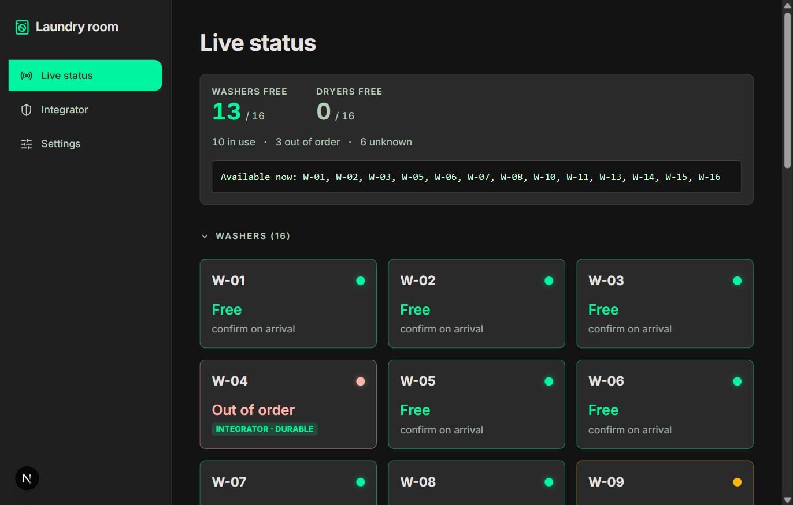
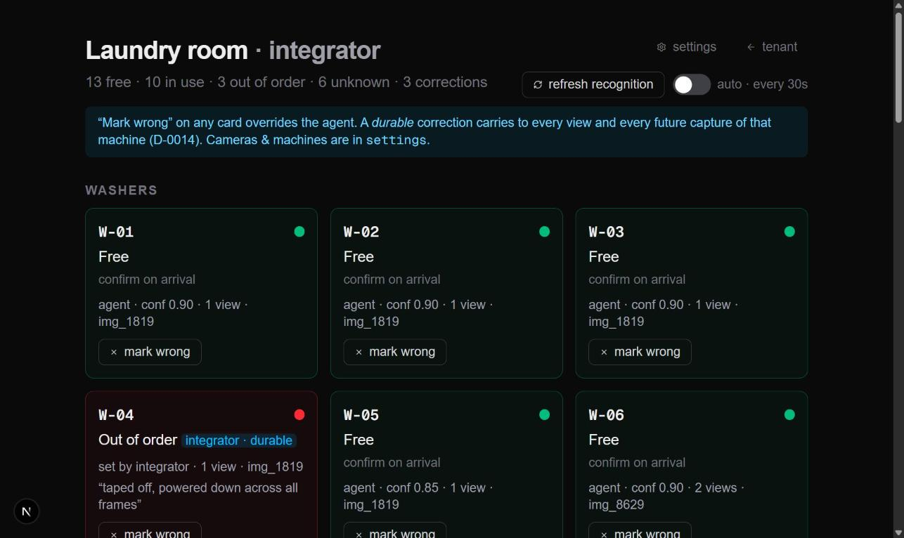
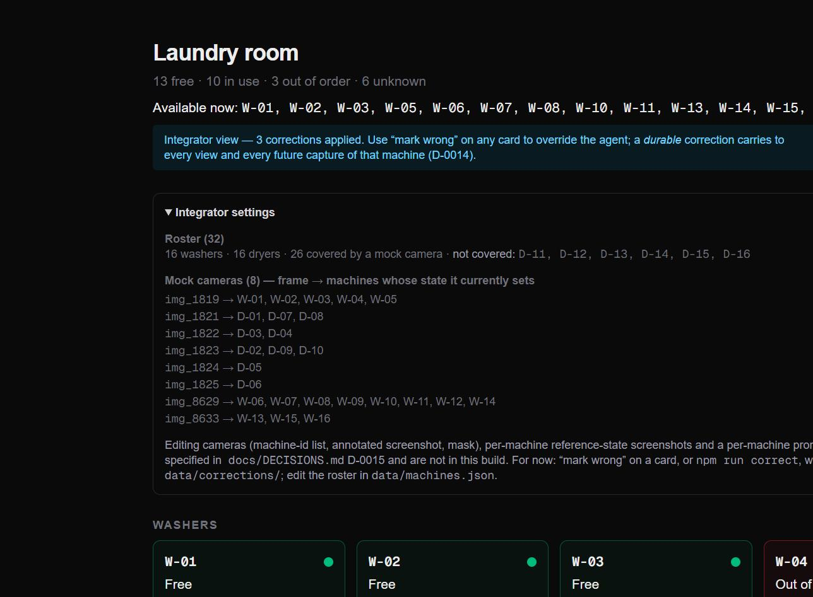

# laundry3

A project for the **micro1 Agentic Workflows Hackathon**. Deadline for a working solution:
2026-08-30 12:00 UTC-7.

## The intended user & the bottleneck

A tenant in an apartment complex with a **shared laundry room** (here: 16 washers + 16
dryers). Today, to do laundry they gather a full bag, carry it down to the laundry room,
and often find **every machine occupied** — then carry the bag back, wait an unknown
amount of time, and try again, hauling the laundry on every attempt. There is no way to
check availability before the trip, and no way to hold a machine for the few minutes it
takes to walk over.

**laundry3** reads frames from the laundry-room cameras with an agent and publishes a
per-machine **free / occupied / out-of-order / unknown** list, so the tenant checks first
and only walks over when a machine is actually available. Why it matters: it removes wasted
trips and the physical effort of carrying laundry back and forth; for the building it means
better-used machines and fewer complaints.

Full problem statement, scope, phasing, and the data/privacy plan: **`docs/PROBLEM.md`**.

## What's built (hackathon scope)

The core P0: given a laundry-room frame, produce a **verified per-machine status list**.

- **Baseline** — one whole-frame vision call, told which machine ids are in the frame.
- **Agent (Iteration 1)** — classify the whole frame, then a **verification pass**: a second
  focused vision call on the machines that came back `unknown` or low-confidence, listing
  explicit out-of-order / occupied / free cues; its answers override the first pass. Then an
  abstain floor so a near-guess becomes an honest `unknown`.

### Results — `claude-haiku-4-5`, 9 committed frames, 45 determinate observations

| Metric | Baseline | Iter 1 (verify) | Iter 2 (verify + corr.) | **Final: classify + corr.** |
| --- | --- | --- | --- | --- |
| Per-machine accuracy | 62.2% | 57.8% | 75.6% | **80.0%** |
| **Harmful-error rate** (told `free`, actually not) | 2.2% | 0.0% | 0.0% | **0.0%** |
| Coverage (gave an actionable answer) | 95.6% | 100% | 100% | 95.6% |
| **`out_of_order` recall** | 0/8 | 0/8 | 8/8 | **8/8** |
| Model cost per frame | ~$0.004 | ~$0.006 | ~$0.006 | **~$0.004** |

**Iteration 1 (verification pass) did not pan out on the deploy model.** It over-commits —
flipping correctly-`free` machines to `occupied` — so accuracy drops 4 points. Kept in-tree,
config-gated, as a documented negative result.

**Iteration 2 (integrator corrections) is the improvement.** The vision model can't tell a
hard-error display from a running cycle, so `out_of_order` recall is 0/8. An integrator
records **3 durable facts** — "`W-04` / `D-02` / `D-06` are out of service" — once; they
override the agent in every frame and every future capture, at no model cost. Dropping the
regressive verify pass and keeping the corrections is the strongest config: **80.0%**,
`out_of_order` **8/8**.

**Read the delta honestly:** a correction is human ground truth applied as an override, so it
scores 100% on its own cell by construction — "+18 pp" means "an integrator overrode 8 of 45
cells to their known-correct value." What that legitimately shows: the `out_of_order` failure
is real and unfixed by prompting, and one durable fact per broken unit clears it everywhere
for free. All runs `--replay`-reproducible offline. Full write-up: **`docs/CHANGELOG.md`**.

### The portal

`npm run dev` → two pages that fuse the agent's per-machine assessments across every camera
angle and **overlay the integrator corrections** (`src/portal/room-status.ts` +
`src/stores/machines-store.ts`, MobX):

- **`/`** — the tenant room view: current state per machine, nothing else. No API call, so it
  prerenders (`○ /`).
- **`/integrator`** — the integrator console: per-card agent confidence + source frame + a
  **“✕ mark wrong”** control, a **“↻ refresh recognition”** button, and a site overview.
  Server-rendered per request so it reflects live `data/corrections/` + `data/machines.json`.

Both show the **Final "classify + corrections" config** (80.0%,
`docs/artifacts/eval-baseline-corrected-2026-08-28.json`), not the Iteration-1 verify pass.
Reservations and a live feed are P2, not wired.





Every card is one machine from `data/machines.json` (**16 washers + 16 dryers**); the mock
photos only cover 26 of them, so `D-11…D-16` show as `unknown` / "not covered".

**Integrator walkthrough (no API key, no hardware).** The judge can walk the whole
correction loop on the frozen dataset:

```bash
npm run dev            # http://localhost:3000
```

1. Open `http://localhost:3000/integrator` — every card shows the agent's confidence, the
   frame it came from, and a **“✕ mark wrong”** control. The **Site overview** lists the
   32-machine roster and which mock frame currently drives each machine's state;
   **“↻ refresh recognition”** re-runs the fusion (in the D-0016 container this is where a
   real re-capture + re-classify would run).
2. Find a machine the agent got wrong (e.g. a `free` washer shown as `In use`). Click
   **mark wrong**, pick the correct state, optionally tick **“applies to this machine in
   every view (durable)”**, add a note, submit.
3. `POST /api/corrections` writes `data/corrections/<frame>.json` and returns the re-fused
   room; the card flips immediately and gets an **integrator** badge. A *durable* correction
   also carries to every other view of that machine.
4. Re-score with the same correction store:
   `npm run eval -- --mode=baseline --split=evaluation --replay --corrections`.

The tenant view (`/`) shows only the resulting state — no confidence, no controls. Full
deployment shape (Docker, `FrameSource`, static-image mock, the correction→prompt feedback
loop): `docs/DECISIONS.md` D-0014 / D-0015 / D-0016.

### Main failure mode & hot take

**Failure mode:** the verification pass *over-commits*. Asked to re-examine a low-confidence
machine, `claude-haiku-4-5` resolves the doubt by choosing the more eventful label — a lit
standby panel becomes `occupied`, an "E" error code becomes `occupied` — so it trades 2
recovered `unknown`s for 4 new `free`→`occupied` errors and never reaches `out_of_order`.

**Hot take:** the highest-leverage work was building the metric *before* the agent, and
knowing when to stop asking the model. A verification pass that looked like a safety win on
`claude-sonnet-5` was **net-negative on accuracy** on the cheaper model we'd actually deploy
— only separate `harmful` / coverage / `out_of_order` scoring made that visible instead of
shippable. What finally moved the metric wasn't a cleverer prompt: it was letting an
integrator write **3 authoritative facts** the model kept getting wrong. Decide what each
error costs, encode it in the metric, and recognise the failures a human should just
overrule rather than the agent re-litigate.

## How agents are used

- **The solution agent** (`src/agent/`) — a two-step vision pipeline (classify → verify),
  behind a `VisionClient` interface with a response cache so every scored run reproduces
  key-free (`--replay`). The verify step is config-gated and, on the deploy model, a
  documented regression — see the results above.
- **Integrator corrections** (`src/eval/corrections.ts`, `npm run correct`) — a human-in-the-
  loop store the agent treats as authoritative. `machine`-scope corrections encode durable
  facts (a broken unit) that carry to every frame. This is the step that actually moved the
  metric (Iteration 2).
- **`grillme`** skill — a Socratic interview that turned the one-line brief into the scoped
  problem, metric, and dataset plan (`docs/trajectories/` has the outcome; `docs/PROBLEM.md`
  the result).
- **`hackathon-compliance` subagent** (`.claude/agents/`) — an independent reviewer run on
  every change against `docs/HACKATHON-RULES.md`; it caught a reproducibility blocker (the
  cache keyed on image bytes) and several overclaims. Records under
  `docs/trajectories/compliance/`.
- **`find-skills`** — on-demand skill discovery.

Details: **`docs/SKILLS.md`**, **`docs/DECISIONS.md`** (D-0003, D-0004, D-0011–D-0013).

## Tech stack

TypeScript · Node 24 · Next.js 16 (App Router) · Tailwind CSS v4 · MobX 7 · `@anthropic-ai/sdk`.
Exact versions and rationale: `docs/DECISIONS.md` (D-0001).

## Quick start

```bash
npm ci
git config core.hooksPath .githooks          # dataset-privacy pre-commit gate
npm run eval -- --mode=baseline --split=evaluation --replay   # reproduce the baseline — no API key, no cost
npm run eval -- --mode=agent    --split=evaluation --replay   # reproduce the agent run
```

Checks: `npm run typecheck`, `npm run lint`, `npm run format:check`, `npm run build`,
`npm test` (27), `npm run check:data`. Full clean-environment walkthrough (including a
`--live` re-run and the dataset pipeline): **`docs/REPRODUCTION.md`**.

## Configuring for a real site

Edit **`laundry3.config.ts`** — reservation hold time, per-user reservation limit, machine
roster, refresh interval, vision model, cost caps, cycle-length fallbacks, paths. Every
setting is documented in **`docs/CONFIGURATION.md`** and validated on load.

## Project layout

```
laundry3.config.ts  Deployment config (site-integration knobs)
src/config/         Typed config: defaults, loader + validator, tests
src/eval/           Label schema, dataset loaders, scoring (accuracy / harmful-error / coverage)
src/agent/          Vision client (+ cache/replay), reply parser, baseline, agent pipeline
src/portal/         room-status: fuse the eval report into a per-machine room view
src/app/, src/stores/, src/components/   Next.js portal page + MobX MachinesStore
scripts/            prepare-dataset · run-eval · label · gen-initial-labels · check-data-privacy
data/               raw/ (ignored) · public/frames/ (9 labelled eval stills, redacted) · labels/ · splits/ · cache/ — see data/README.md
docs/               Hackathon deliverables (see the table below)
.claude/            Claude Code config: hackathon-compliance subagent, git-guard hook, /worklog
```

## Documentation

| File | What it holds |
| --- | --- |
| `docs/PROBLEM.md` | Problem, user, bottleneck, scope, definition of "good", privacy plan |
| `docs/CHANGELOG.md` | **Improvement Changelog** — baseline → Iteration 1, with evidence + removed dead-end |
| `docs/EVALUATION.md` | Metric, cases, rubric, known limitations, recorded results |
| `docs/REPRODUCTION.md` | Clean-environment setup, exact commands, expected output, runtime & cost |
| `docs/DECISIONS.md` | Decision log (D-0001 … D-0013) |
| `docs/CONFIGURATION.md` | Every deployment-config setting: type, default, meaning |
| `docs/LABELING.md` | How an integrator turns frames into ground truth |
| `docs/SKILLS.md` | Connected agent skills and when to use them |
| `docs/HACKATHON-RULES.md` | Full transcription of the hackathon rules |
| `docs/trajectories/` | Agent trajectory records — `runtime/` (solution agent), `compliance/` (reviewer) |
| `docs/WORKLOG.md` | Chronological record of every change |
| `CLAUDE.md` | Agent working agreement for this repo |

## What existed before the hackathon

Nothing. Created 2026-08-28. `create-next-app` provided the initial Next.js scaffold; every
other change is a dated entry in `docs/WORKLOG.md`.
